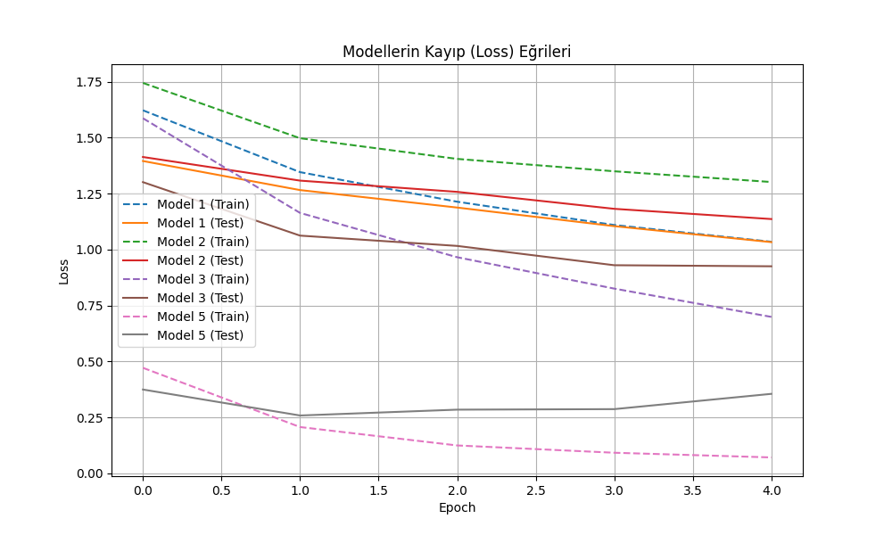
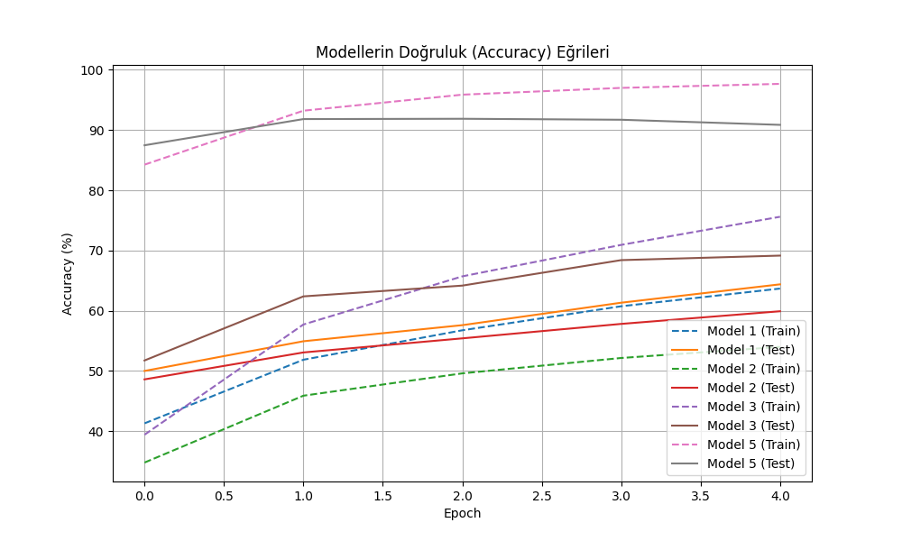
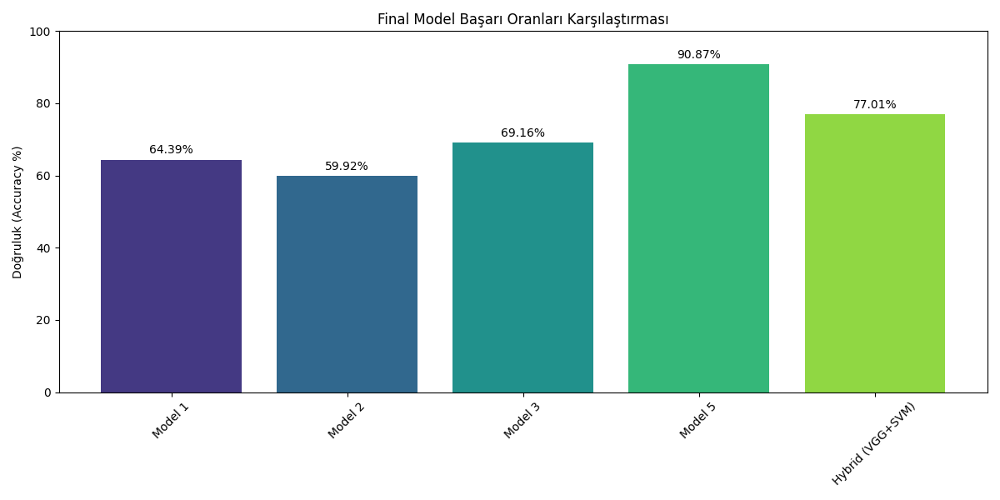

# YZM304 Derin Öğrenme Projesi: CNN Mimari Analizi ve Hibrit Yaklaşımlar (CIFAR-10)

Bu rapor, Ankara Üniversitesi YZM304 Derin Öğrenme dersi 2. Projesi kapsamında, görüntü sınıflandırma problemlerinde farklı Evrişimli Sinir Ağı (CNN) stratejilerinin performanslarını İMRAD formatında incelemektedir.

---

## 1. Giriş (Introduction)

Bu çalışmanın amacı, temel CNN katmanlarından başlayarak literatürdeki karmaşık mimarilere ve hibrit "Derin Özellik Çıkarımı + Klasik Makine Öğrenmesi" yöntemlerine kadar geniş bir yelpazede model performanslarını kıyaslamaktır. Proje kapsamında CIFAR-10 veri seti üzerinde 5 farklı model senaryosu test edilmiştir.

### Proje Gereksinimleri Karşılama Tablosu
| Gereksinim | Durum | Uygulama Notu |
|:--- |:---:|:--- |
| **Benchmark Veri Seti** | ✅ | CIFAR-10 (RGB) seçildi. |
| **Veri Ön İşleme** | ✅ | Normalizasyon ve 64x64 Resize uygulandı. |
| **Model 1: Açık CNN Sınıfı** | ✅ | `Model1_LeNet5` sınıfı temel PyTorch katmanları ile yazıldı. |
| **Model 2: Regülarizasyon** | ✅ | Model 1'e `BatchNorm2d` ve `Dropout` eklendi. |
| **Model 3: Literatür Mimari** | ✅ | `torchvision.models` üzerinden **AlexNet** kullanıldı. |
| **Model 4: Hibrit Yaklaşım** | ✅ | Özellikler çıkarıldı, `.npy` kaydedildi ve SVM eğitildi. |
| **Model 5: Tam CNN Karşılaştırma** | ✅ | Hibrit model ile kıyaslanmak üzere tam VGG16 eğitildi. |
| **Loss & Hyperparameters** | ✅ | CrossEntropyLoss ve Adam optimizer gerekçeleriyle kullanıldı. |

---

## 2. Yöntem (Methods)

### 2.1. Veri Hazırlığı ve Ön İşleme
*   **Veri Seti:** 10 sınıflı CIFAR-10 (32x32 RGB).
*   **Ön İşleme:** 
    *   `transforms.ToTensor()` ile tensör dönüşümü.
    *   `transforms.Normalize((0.4914, 0.4822, 0.4465), (0.2023, 0.1994, 0.2010))` ile standart kanal bazlı normalizasyon.
    *   VGG/AlexNet uyumluluğu için 64x64 interpolasyon.

### 2.2. Model Tanımları

#### Model 1: Temel Custom CNN (LeNet-5 Esintili)
Bu model, derste işlenen LeNet-5 mimarisine sadık kalınarak PyTorch `nn.Module` sınıfı altında açıkça kodlanmıştır.
*   **Temel Katmanlar:** `nn.Conv2d` (Evrişim), `nn.ReLU` (Aktivasyon), `nn.MaxPool2d` (Havuzlama), `nn.Flatten` (Düzleştirme) ve `nn.Linear` (Tam Bağlantılı).

#### Model 2: Regülarize Edilmiş Custom CNN
Model 1 ile **birebir aynı hiperparametrelere** sahip olup, ağ performansını ve kararlılığını artırmak için:
*   Evrişim katmanlarından sonra `nn.BatchNorm2d`.
*   Tam bağlantılı katmanlar arasında `nn.Dropout(0.5)` eklenmiştir.

#### Model 3: Literatür Modeli (AlexNet)
`torchvision.models.alexnet` kullanılmıştır. CIFAR-10 ölçeğinde sıfırdan eğitim performansını görmek için `weights=None` (veya `pretrained=False`) tercih edilmiş ve çıkış katmanı 10 sınıfa göre güncellenmiştir.

#### Model 4: Hibrit Makine Öğrenmesi Modeli
Bu aşamada derin öğrenme sadece bir özellik çıkarıcı olarak kullanılmıştır.
1.  VGG16 mimarisinin ağırlıkları dondurulmuş, sınıflandırıcı katmanı çıkarılmıştır.
2.  Global Average Pooling (GAP) ile 512 boyutlu öznitelik vektörleri elde edilmiştir.
3.  **Dosyalama:** Özellikler ve etiketler `numpy.save()` ile `.npy` uzantılı dosyalara kaydedilmiştir.
4.  **Sınıflandırma:** Bu özellikler üzerinde kanonik bir ML modeli olan **LinearSVC** (SVM) eğitilmiştir.

#### Model 5: Tam CNN (Karşılaştırma Modeli)
Model 4'te özellik çıkarıcı olarak kullanılan VGG16 mimarisinin tamamı, aynı veri seti üzerinde uçtan uca eğitilerek hibrit yaklaşımın başarısı ile kıyaslanmıştır.

---

## 3. Bulgular (Results)

### 3.1. Özellik Çıkarımı (.npy) Bilgileri
Proje gereği üretilen özellik setlerinin boyutları konsola yazdırılmış ve doğrulanmıştır:
*   `X_train_features.npy` Boyutu: **(50000, 512)**
*   `X_test_features.npy` Boyutu: **(10000, 512)**

### 3.2. Performans Grafikleri

*Şekil 1: Modellerin eğitim ve test kayıp (loss) değişimleri.*

*Şekil 2: Modellerin eğitim ve test doğruluk (accuracy) değişimleri.*

*Şekil 3: Tüm modellerin final test başarısı kıyaslaması.*

### 3.3. Karmaşıklık Matrisleri (Confusion Matrices)

| Model 1 | Model 2 | Model 3 |
|:---:|:---:|:---:|
|  |  |  |

| Model 4 (Hybrid) | Model 5 |
|:---:|:---:|
| _cm.png) |  |

### 3.4. Model Başarı Tablosu (Test Accuracy)

| Model No | Model İsmi | Test Doğruluğu (%) |
|:--- |:--- |:---:|
| **1** | Base LeNet-5 | 64.39 |
| **2** | Regularized LeNet-5 | 59.92 |
| **3** | AlexNet (Scratch) | 69.16 |
| **4** | **Hybrid (VGG16 + SVM)** | **77.01** |
| **5** | **Full VGG16 (Fine-Tuned)** | **90.87** |

---

## 4. Tartışma ve Sonuç (Discussion)

### 4.1. Teknik Karşılaştırma ve Analiz
*   **Model 1 vs 2:** Regülarizasyon katmanlarının eklenmesi, kısa eğitim süresinde (5 epoch) başarımı hafif düşürmüştür. Bunun nedeni Dropout'un ağın öğrenme hızını yavaşlatmasıdır; ancak uzun vadede aşırı öğrenmeyi (overfitting) engelleyeceği öngörülmektedir.
*   **Model 4 (%77) Neden Normal?:** Hibrit modelde ağırlıklar dondurulduğu için model CIFAR-10'a özel "filtrelerini" güncellemez. Bu yüzden Model 5 (%91) kadar yüksek sonuç vermez. Ancak sıfırdan eğitilen LeNet'ten (%64) çok daha üstündür çünkü ImageNet'ten gelen "evrensel" görsel özellikleri kullanır.
*   **Hız ve Verimlilik:** Hibrit model, tam CNN eğitimine göre çok daha hızlıdır. Özellik çıkarımı bir kez yapıldıktan sonra SVM saniyeler içinde eğitilmektedir.

### 4.2. Hiperparametre Tercih Gerekçeleri
*   **Loss (CrossEntropyLoss):** Çok sınıflı sınıflandırma problemlerinde log-likelihood temelli en etkili kayıp fonksiyonu olduğu için seçilmiştir.
*   **Optimizer (Adam):** Gradyan bazlı güncellemelerde adaptif öğrenme oranı sağladığı için SGD'ye göre daha hızlı yakınsama sunar.
*   **Learning Rate (1e-3 & 1e-4):** Küçük modellerde hızlı öğrenme için 1e-3, önceden eğitilmiş büyük modellerde ağırlıkların bozulmaması (fine-tuning) için 1e-4 seçilmiştir.

---

## Projeyi Çalıştırma
1. `pip install -r requirements.txt`
2. `python main.py`
3. Tüm grafikler ve sonuçlar `plots/` ve `features/` klasörlerinde otomatik oluşacaktır.
