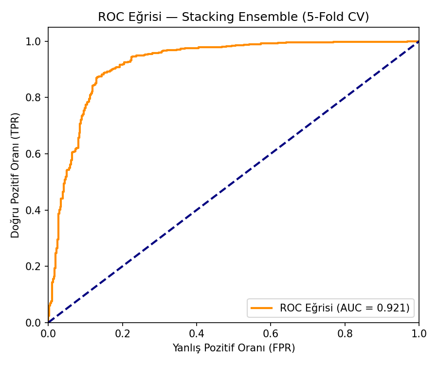
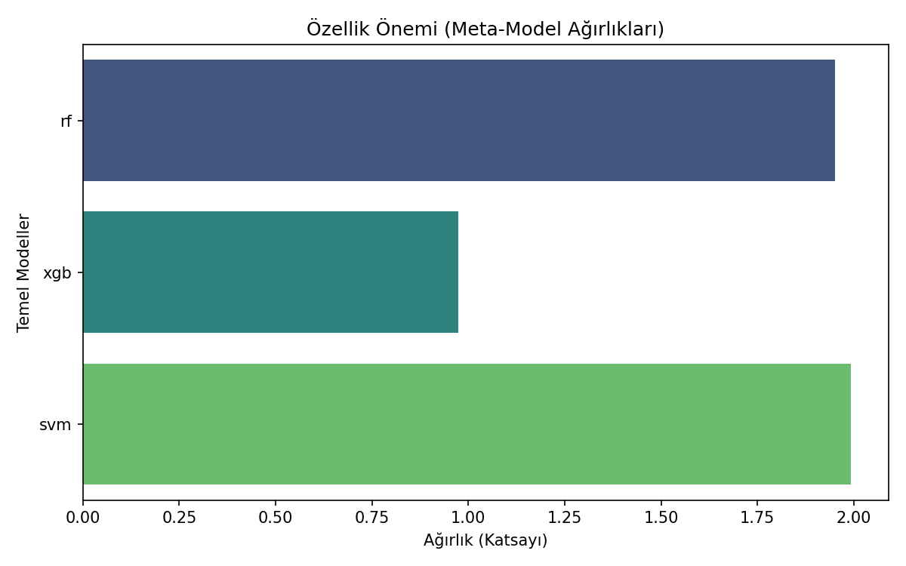
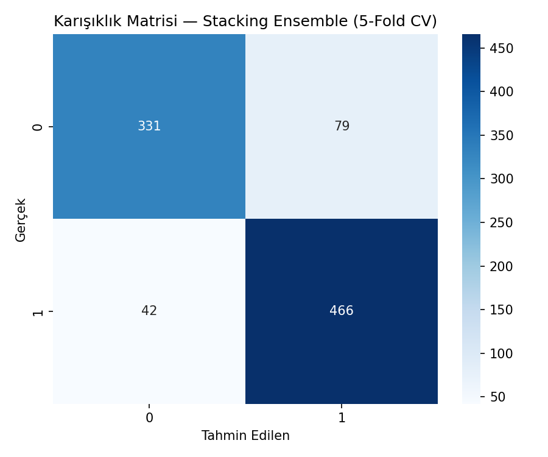

# YZM304 Makine Öğrenmesi Projesi: Hibrit Stacking Ensemble ile Kalp Hastalığı Tahmini

Bu rapor, Ankara Üniversitesi YZM304 Makine Öğrenmesi dersi kapsamında, kalp hastalığı teşhisinde farklı ML modellerini ve **Hibrit Stacking Ensemble** yaklaşımını İMRAD formatında incelemektedir.

---

## 1. Giriş (Introduction)

Bu çalışmanın amacı, kalp hastalığı tahmininde klasik ML modellerinden başlayarak hibrit ensemble yöntemlerine kadar geniş bir yelpazede model performanslarını kıyaslamaktır. Proje kapsamında iki farklı önişleme senaryosu (A/B testi) ve 5 farklı model senaryosu test edilmiştir.

### Proje Gereksinimleri Karşılama Tablosu
| Gereksinim | Durum | Uygulama Notu |
|:--- |:---:|:--- |
| **Veri Seti** | ✅ | Heart Failure Prediction Dataset (918 örnek, 5 klinik kaynak) |
| **Özellik Mühendisliği** | ✅ | ClinicalRatio ve SeverityScore türetildi |
| **Önişleme A/B Testi** | ✅ | Baseline (SimpleImputer + StandardScaler) vs Gelişmiş (MICE + RobustScaler) |
| **Temel Modeller** | ✅ | Logistic Regression, Random Forest, XGBoost, MLP |
| **Hibrit Ensemble** | ✅ | Stacking: RF + XGBoost + SVM → Logistic Regression (Meta-Learner) |
| **Çapraz Doğrulama** | ✅ | 5-Fold Stratified CV, OOF tahminlerle görselleştirme |

---

## 2. Yöntem (Methods)

### 2.1. Veri Hazırlığı ve Özellik Mühendisliği
*   **Veri Seti:** Cleveland, Hungarian, Switzerland, Long Beach VA ve Stalog veri setlerinin birleşimi olan 918 örnekli Heart Failure Prediction Dataset.
*   **Türetilen Özellikler:**
    *   `ClinicalRatio = Cholesterol / MaxHR` — Kolesterol yükünün kardiyak kapasiteye oranı.
    *   `SeverityScore = ChestPainMapped + ExerciseAnginaMapped` — Göğüs ağrısı tipi (ASY=4, TA=3, ATA=2, NAP=1) ve egzersiz anjini (Evet=1, Hayır=0) toplanarak oluşturulan kompozit risk skoru.
*   **Eksik Veri:** `Cholesterol == 0` değerleri eksik veri olarak işaretlenmiştir.

### 2.2. Önişleme Senaryoları (A/B Testi)

| | Senaryo A (Baseline) | Senaryo B (Gelişmiş) |
|---|---|---|
| **Eksik veri** | `SimpleImputer` (mean) | `IterativeImputer` (MICE) |
| **Ölçeklendirme** | `StandardScaler` | `RobustScaler` |
| **Kategorik** | `OneHotEncoder` | `OneHotEncoder` |

### 2.3. Model Tanımları

#### Logistic Regression (Baseline)
İstatistiksel referans noktası. Doğrusal karar sınırı çizer, yorumlanabilirlik açısından güçlüdür.

#### Random Forest
Bagging tabanlı karar ormanı. Aşırı öğrenmeyi (overfitting), ağaçları rastgele alt kümelerle eğitip çoğunluk oylaması yaparak çözer.

#### XGBoost
Gradient Boosting tabanlı model. Ağaçlar birbirinin hatalarını öğrenerek ilerler, yüksek performans sunar.

#### MLP (Çok Katmanlı Yapay Sinir Ağı)
Gizli katmanları (64-32) olan derin öğrenme yaklaşımı. Doğrusal olmayan ilişkileri yakalar.

#### Stacking Ensemble (Hibrit)
Tek bir modele güvenmek yerine modelleri birleştiren hibrit yaklaşım:
*   **Seviye 0 (Uzmanlar):** Random Forest, XGBoost, SVM
*   **Seviye 1 (Meta-Learner):** Lojistik Regresyon
*   5-Fold CV + OOF tahminler kullanılarak veri sızıntısı (data leakage) önlenmiştir.

---

## 3. Bulgular (Results)

### 3.1. Model Karşılaştırma Tablosu (5-Fold Stratified CV)

| Model | Senaryo | Accuracy | Recall | F1-Score | AUC-ROC |
|:--- |:---:|:---:|:---:|:---:|:---:|
| Logistic Regression | A | 0.870 | 0.902 | 0.885 | 0.928 |
| Logistic Regression | B | 0.865 | 0.896 | 0.880 | 0.925 |
| Random Forest | A | 0.858 | 0.892 | 0.875 | 0.923 |
| Random Forest | B | 0.861 | 0.882 | 0.875 | 0.920 |
| XGBoost | A | 0.850 | 0.880 | 0.867 | 0.917 |
| XGBoost | B | 0.854 | 0.880 | 0.870 | 0.916 |
| MLP | A | 0.840 | 0.860 | 0.856 | 0.898 |
| MLP | B | 0.832 | 0.854 | 0.849 | 0.894 |
| **Stacking Ensemble** | **A** | **0.869** | **0.913** | **0.886** | **0.925** |
| **Stacking Ensemble** | **B** | **0.868** | **0.917** | **0.885** | **0.924** |

> **En yüksek Recall: %91.7** — Stacking Ensemble (Senaryo B). Sağlık uygulamalarında hasta kaçırma oranını minimize etmek kritik olduğundan, Recall metriği ön plandadır.

### 3.2. Performans Grafikleri

*Şekil 1: Stacking Ensemble modelinin ROC eğrisi (5-Fold CV, AUC = 0.921).*

*Şekil 2: Meta-Model (Lojistik Regresyon) ağırlıkları — hangi temel modele ne kadar güvenildiğini gösterir.*

### 3.3. Karışıklık Matrisi

*Şekil 3: Stacking Ensemble karışıklık matrisi (5-Fold CV, out-of-fold tahminler).*

---

## 4. Tartışma ve Sonuç (Discussion)

### 4.1. Teknik Karşılaştırma ve Analiz
*   **Stacking vs Tekli Modeller:** Stacking Ensemble, Accuracy'de tekli modellere yakın sonuç verirken Recall'da belirgin iyileşme sağlamıştır (%91.7). Bu, farklı algoritmaların varyanslarını sönümleyerek (hata korelasyonlarını azaltarak) hasta kaçırma oranını minimize ettiği anlamına gelir.
*   **Senaryo A vs B:** Gelişmiş önişleme (MICE + RobustScaler) çoğu modelde Baseline'a yakın veya hafif düşük sonuçlar vermiştir. Bu, veri setindeki eksik veri oranının düşük olmasından kaynaklanmaktadır.
*   **Bias-Variance Dengesi:** XGBoost'un veya Random Forest'ın düştüğü yanlılıkları (bias), farklı bir algoritma olan SVM dengeler. Meta-Model ise bu farklılıkların varyansını sönümleyerek en kararlı (robust) kararı verir.

### 4.2. Etik Değerlendirme
*   **False Negative Riski:** Hasta kişiye "sağlıklı" demek → Ölüm riski. Bu yüzden Recall metriği kritiktir.
*   **False Positive Riski:** Sağlıklı kişiye "hasta" demek → Gereksiz ameliyat ve psikolojik stres.
*   **Gelecek Çalışmalar:** SHAP ve LIME gibi Açıklanabilir Yapay Zeka (XAI) araçları entegre edilmelidir.

---

## Projeyi Çalıştırma
1. `pip install -r requirements.txt`
2. `python main.py`
3. Tüm grafikler ve sonuçlar `plots/` klasöründe otomatik oluşacaktır.
