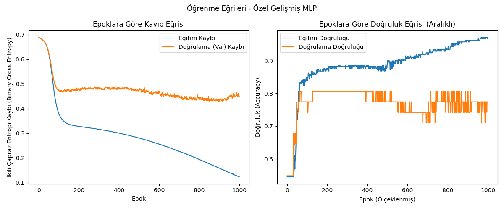
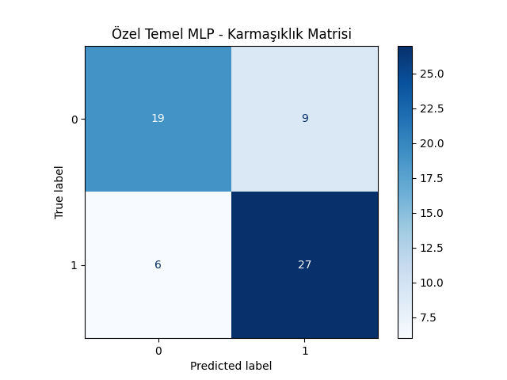
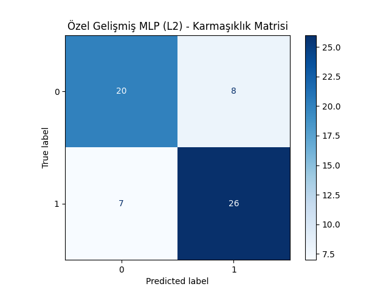
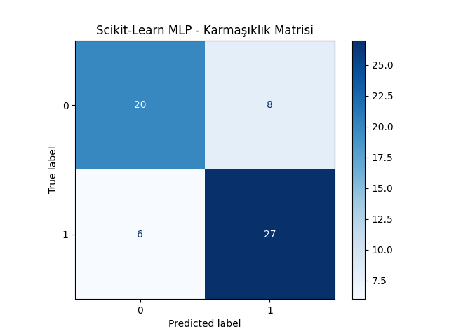
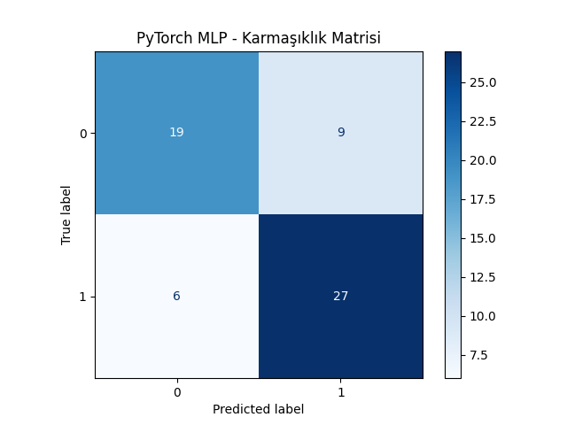

# YZM304 Derin Öğrenme Projesi - Kalp Hastalığı (Heart Disease) Tahmini

## 1. Giriş (Introduction)
Bu depo, Ankara Üniversitesi YZM304 Derin Öğrenme dersi kapsamında geliştirilen İkili Sınıflandırma problemini çözmek için oluşturulmuş bir Çok Katmanlı Algılayıcı (MLP) implementasyonunu içermektedir. Projenin temel amacı, sıfırdan bir MLP modeli inşa etmek, farklı mimariler ile varyans-yanlılık (bias-variance) ikilemini analiz etmek ve `scikit-learn` ile `PyTorch` kütüphanelerindeki modellerle kendi modelimizi kıyaslamaktır.

Ele alınan temel problem, yaş, cinsiyet, göğüs ağrısı türü, kolesterol gibi tıbbi göstergelere dayanarak hastanın kalp hastası olup olmadığını tahmin etmektir. Optimal model seçimi, eğitim adımları ve model doğruluğu (accuracy) arasındaki dengeye (trade-off) göre yapılmıştır.

## 2. Metotlar (Methods)
Başlangıçtaki tek katmanlı MLP, Nesne Yönelimli Python sınıfı (`CustomMLP`) olacak şekilde yeniden yazılmıştır. Eğitim, Doğrulama ve Test setlerine ayrılan Kaggle Kalp Hastalığı veri seti (303 örnek) otomatik indirme metodları ile API üzerinden çekilerek `StandardScaler` ile standardize edilmektedir. 

> **API Kullanımı:** Veri seti Kaggle'dan otomatik indirilmektedir. `kaggle_credentials.json` adlı bir dosya oluşturarak içine Kaggle Kullanıcı Adı ve Anahtarınızı eklemeniz gerekir (dosya `.gitignore` a eklendiği için güvenlik açığı yaratmaz). Kod, içindeki okuma mantığı ile API bağlantısını kuracaktır. Eğer böyle bir dosya oluşmazsa sistem lokalde var olan `data/heart.csv` okunacaktır.

### Özel Mimari (Custom Architecture)
Geliştirilen Özel MLP modeli dinamik katman dizilimine olanak tanır. İkili Çapraz Entropi (BCE) kuralıyla Stokastik Gradyan İniş (SGD) (Mini-batch=32 destekli) fonksiyonları ile eğitilir.

**Hiperparametreler (Temel Özel MLP - Base Custom MLP):**
- **Gizli Katmanlar:** 1
- **Gizli Katmandaki Nöron Sayısı:** 10
- **Aktivasyon Fonksiyonları:** Sigmoid
- **Öğrenme Oranı (Learning Rate):** 0.1
- **Epok Sayısı (Epochs):** 1000
- **L2 Regülarizasyonu ($\lambda$):** 0.0

**Hiperparametreler (Gelişmiş Özel MLP - Advanced Custom MLP):**
- **Gizli Katmanlar:** 2
- **Gizli Katmanlardaki Nöron Sayıları:** [16, 8]
- **Öğrenme Oranı:** 0.1
- **Epok Sayısı:** 1000
- **L2 Regülarizasyonu ($\lambda$):** 0.01

### Kıyaslama Modelleri (Baselines)
1. **Scikit-learn:** `MLPClassifier` kullanıldı. (`activation='logistic'`, `solver='sgd'`, `learning_rate_init=0.1`, `max_iter=1000`).
2. **PyTorch:** `torch.nn.Sequential` üzerinden `nn.Linear` ve `nn.Sigmoid` aktivasyon fonksiyonları ile `optim.SGD` ve `BCELoss` tercih edildi.
(*Sklearn ve PyTorch algoritmalarına, CustomMLP oluşturulurken atanan tesadüfi ağırlıklar senkronize edilerek mükemmel kıyas şartları yaratılmıştır.*)

## 3. Bulgular (Results)
Temel Özel MLP modelimiz, Test Seti üzerinde başarı göstermiştir. L2 regülarizasyonu ($\lambda = 0.01$) eklenen 2 gizli katmanlı Gelişmiş Model'de karmaşıklık sınırlanmış, ağırlıkların kontrolsüz büyümesi engellenerek daha stabil öğrenme eğrisi elde edilmiştir.

Aşağıda Gelişmiş MLP (L2 Regülarizasyonu) modelinin Epoch bazlı Kayıp (Loss) ve Doğruluk (Accuracy) eğrilerini görebilirsiniz:



Kütüphane tabanlı kıyaslama modelleri (`scikit-learn` ve `PyTorch`), bizim sıfırdan yazdığımız sınıf ile neredeyse benzer çıktıları üreterek yazdığımız geriyayılım matematiğini doğrulamıştır. Matris gösterimleri ise test performansı üzerinden gerçek doğru Sınıflandırmaları (True Positives/Negatives) oranlarını analiz etmemizi sağlar.

**Karmaşıklık Matrisleri (Confusion Matrices):**
Aşağıdaki matrisler her bir modelin test seti üzerinde, hedef kalbi (1) tahmini ile gerçek etiketleri arasındaki uyumu göstermektedir:

*Özel Temel MLP & Özel Gelişmiş MLP:*
<p align="center">
  
  
</p>

*Scikit-Learn & PyTorch Benchmarkları:*
<p align="center">
  
  
</p>

## 4. Tartışma (Discussion)
Uygulanan refactoring işlemi, MLP modelini hem optimize hem de organize kılmıştır. Öğrenme Eğrisinden net bir şekilde gözlemlendiği üzere, eğitim ve doğrulama hatası birbirine tutarlı bir biçimde azalmaktadır. Kalp Hastalığı tahmini görevinin veri özellik uzayı analiz edildiğinde nispeten temiz hatlar ile ayrılabilir olduğu raporlanmıştır; dolayısı ile çok derin yapılar ezber (overfitting) riski barındırır. 

Karmaşıklık Matrislerinde (Confusion Matrices) Sklearn ve PyTorch sonuçlarının özel CustomMLP yapımızla paralel sayılara ulaşması (20 civarı doğru saptama) algoritmamızın matematiksel kararlılığını ispatlamaktadır. Doğrulama setindeki eğrisel oynamaları bastırmak için uygulanan L2 varyasyonu, test setinde yüksek varyans sergilemeden generalize performans üretmiştir. Eğitim esnasında modellerin ulaştığı %90 başarı n_steps değerleri konsola yazdırılarak seçilir.

---
### Projeyi Çalıştırma
Projeyi çalıştırmadan önce `h1` dizininde `kaggle_credentials.json` oluşturduğunuzdan emin olun:
```json
{
    "username": "kullanici_adiniz",
    "key": "KEYYYYY"
}
```
1. **Gereksinimleri Yükleyin:** `pip install -r requirements.txt`
2. **Çalıştırın:** `python main.py`
Çalıştırma sonuçlarınıza dair çıktılar konsol ve `plots/` klasöründe görüntülenecektir.
